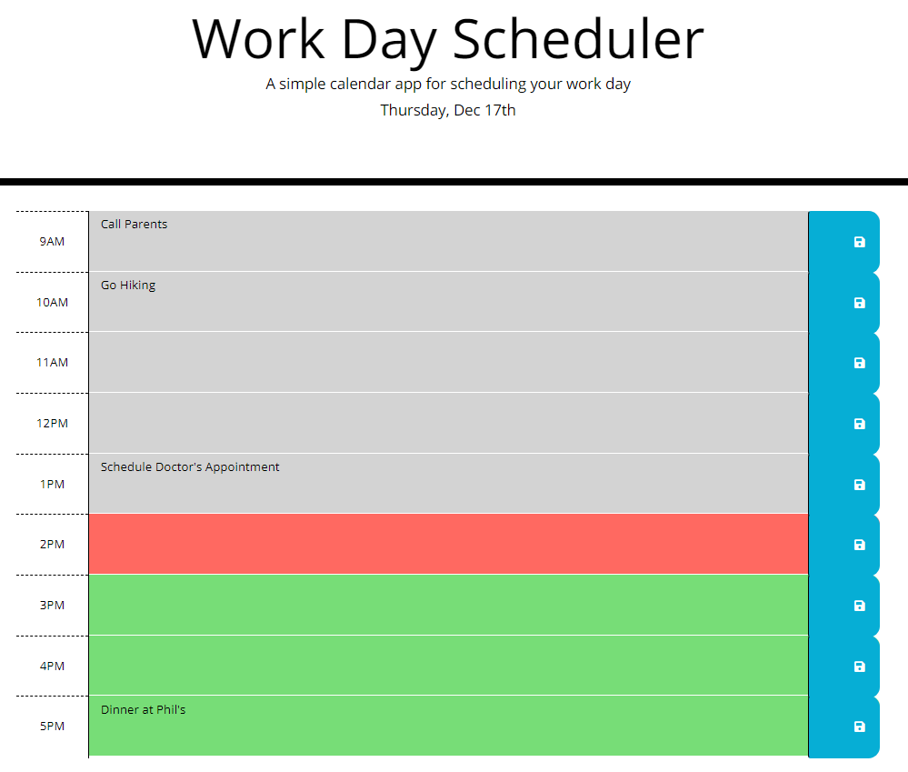

# Work Day Scheduler




## Description 

This planner allows input into indivdual hour slots, and will save inputs upon pressing the blue save button next to the associated hour to local storage. This work day planner also tracks the current hour, leaving past time-blocks grey, the current time-block red, and future time-blocks green.

Moment.js was used for the functions involving dates and times. The decision to use this library over other more modern, optimized libraries was largely due to the library's great documentation. Additionally, the navigation for several other prominent date/time libraries (such as Luxon and Day.js) is similar enough to Moment.js, making the skills acquired easily transferrable.


other components featured in this app are jQuery targeting and functions, usage of 'this', and localStorage setting and retrieval.

### Code Demonstrating 'this' & 'localStorage' Usage
```js

var todo = this.previousElementSibling.value.trim();

        var key_sto = (parseInt($(this).parent().text()));

        var str_todo = JSON.stringify(todo);

        localStorage.setItem(key_sto, str_todo);

```

### Code Demonstrating 'Moment.js' & 'jQuery' Utilization
```javascript
$("#currentDay").text(moment().format("dddd, MMM Do"))
```


### Links
  
* [Deployed Website](https://anzelcapparelli.github.io/work_day_scheduler/)

* [GitHub Repository](https://github.com/anzelcapparelli/work_day_scheduler)


